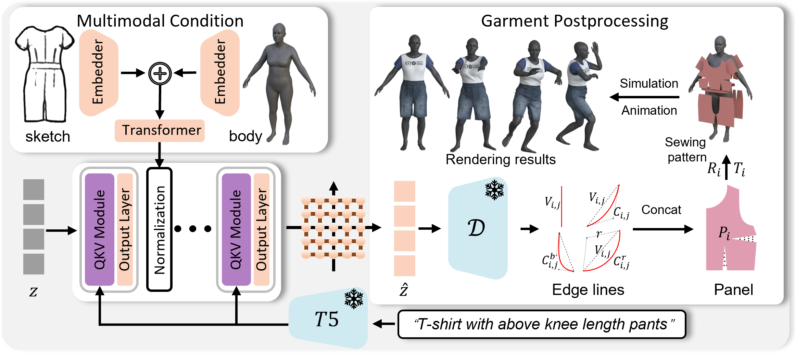

# **SewingLDM**

<div align="center">
  <a href="https://github.com/shengqiliu1/SewingLDM"></a> &ensp;
  <a href="https://shengqiliu1.github.io/SewingLDM/"></a> &ensp;
<a href="https://arxiv.org/abs/2412.14453"></a> &ensp;
  <a href="https://huggingface.co/liusq/sewingldm"></a> &ensp;
</div>

<p align="center">
  
</p>

> [**Multimodal Latent Diffusion Model for Complex Sewing Pattern Generation**](https://arxiv.org/abs/2412.14453) <be>


## **Introduction**

This repository contains the official implementation of Multimodal Latent Diffusion Model for Complex Sewing Pattern Generation.
We design a novel architecture, dubbed SewingLDM, for sewing pattern generation conditioned by texts, body shapes, and garment sketches, enabling precisely controlled and body-suited garment generation.

## 🛠️ Dependencies and Installation

Begin by cloning the repository:
```shell
git clone https://github.com/shengqiliu1/SewingLDM.git
cd SewingLDM
```

Create the environment by conda.

```shell
conda create -n sewingldm python=3.10
conda activate sewingldm
pip install torch==2.0.0 torchvision==0.15.1 torchaudio==2.0.1 --index-url https://download.pytorch.org/whl/cu118
pip install -r requirements.txt
```

## 🧱 Download Pretrained Models

All models are stored in [huggingface](https://huggingface.co/liusq/sewingldm/tree/main), and the file structure is as follows
```shell
SewingLDM
  ├──models
  │  ├──auto_encoder.pth
  │  ├──sewingldm.pth
```

## 🚀 Training

Download [GarmentCodeData (v2)](https://doi.org/10.3929/ethz-b-000690432) and update the paths (data_root, start_config['body_root']) in the config file.

Run the following command to train the auto-encoder:
```shell
sh train_scripts/train_ae.sh
```

Proceed with training the diffusion model after completing the auto-encoder training.
```shell
sh train_scripts/train.sh
```

## 📊 Inference

We provide an example inference script at [generate.sh](https://github.com/shengqiliu1/SewingLDM/blob/master/generate.sh). Please modify the sketch path, text path and body path to use your image/text or different body shape.

## Garment Simulation

In order to drape a sewing pattern in JSON representation, you can refer to the installation and simulation instructions of [GarmentCode](https://github.com/maria-korosteleva/GarmentCode).

## Acknowledgements

This repository is built extensively on top of [PixArt](https://github.com/PixArt-alpha/PixArt-alpha) and [Sewformer](https://github.com/sail-sg/sewformer). Our dataset is based on [GarmentCodeData](https://github.com/maria-korosteleva/GarmentCode). We thank all the authors for their impressive repos.

## 🔗 BibTeX

If you find our work useful, please consider citing:
```
@article{liu2024multimodallatentdiffusionmodel,
    title={Multimodal Latent Diffusion Model for Complex Sewing Pattern Generation}, 
    author={Shengqi Liu and Yuhao Cheng and Zhuo Chen and Xingyu Ren and Wenhan Zhu and Lincheng Li and Mengxiao Bi and Xiaokang Yang and Yichao Yan},
    journal = {International Conference on Computer Vision (ICCV)},
    year={2025}
}
```